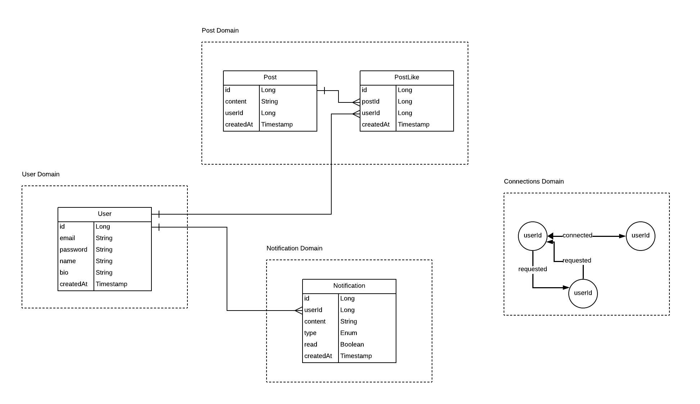

# microBuzz - Micro Blogging Application (Spring Boot)

MicroBuzz is a microblogging application that allows users to share their thoughts and interact in real-time. Built using a microservice architecture with four distinct microservices, including a Registry service powered by Eureka for efficient service discovery, management and API Gateway to handle all client requests and route them to the appropriate service, it ensures seamless and scalable performance for user engagement.

# System Design 

# Key Features of MicroBuzz:

- **Text-Based Microblogging**: Share short, concise text posts with ease.
- **Real-Time Interaction**: Engage with other users through instant updates and interactions.
- **Microservice Architecture**: Scalable and maintainable design using four microservices for optimized performance.
- **Eureka Service Registry**: Utilizes Eureka for efficient service discovery and management.
- **User Registration & Authentication**: Secure user sign-up and login for personalized experience.
- **Scalability**: The microservice-based architecture allows for easy scaling as the user base grows.
- **Lightweight Design**: Focuses on delivering a simple and intuitive user experience with no media uploads (for now).

# E-R Diagram:

